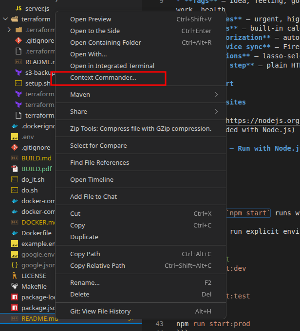
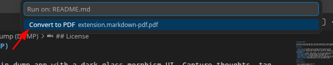
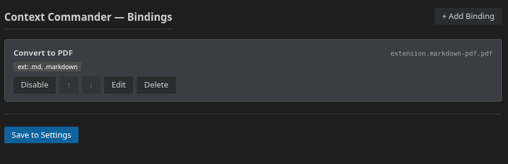
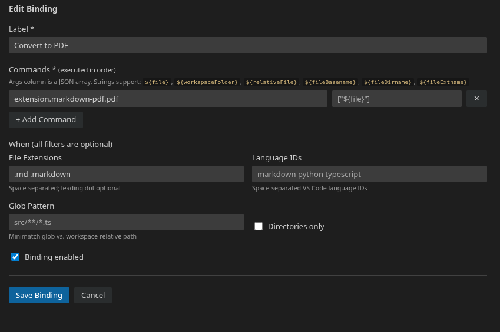

<div align="center">
  

  # Context Commander

  **Bind any command palette command to the Explorer right-click menu — for any file type.**

  [](https://github.com/shadowbq/vscode-context-commander/actions/workflows/ci.yml)
  [](https://github.com/shadowbq/vscode-context-commander/actions/workflows/codeql.yml)
  [](https://github.com/shadowbq/vscode-context-commander/releases)
  [](https://github.com/shadowbq/vscode-context-commander/releases)
  [](LICENSE)
</div>

Context Commander lets you define custom bindings that appear in the Explorer context menu when you right-click a file or folder. Each binding can run one or more VS Code commands in sequence, optionally filtered by file extension, language ID, glob pattern, or directory status.

---

## Features

- **QuickPick picker** — a single "Context Commander..." entry appears in the right-click menu and shows only the bindings that apply to the selected file
- **Sequential command execution** — run multiple commands one after another, awaiting each before the next starts
- **Variable substitution in args** — use `${file}`, `${workspaceFolder}`, `${relativeFile}`, and more
- **Fine-grained filtering** — show bindings only for specific file extensions, language IDs, glob patterns, or directories
- **Settings UI** — manage bindings with a visual editor (`Context Commander: Open Settings` from the Command Palette)
- **Slot mode (opt-in)** — up to 10 bindings appear as individual menu entries instead of behind the picker





**Settings WebView — bindings list:**



**Settings WebView — edit binding form:**



---

## Installation

Search for **Context Commander** in the VS Code Extensions view (`Ctrl+Shift+X`), or install from the [Marketplace](https://marketplace.visualstudio.com/items?itemName=shadowbq.context-commander).

---

## Configuration

Add bindings to your `settings.json` under `contextCommander.bindings`, or use the visual editor via **Context Commander: Open Settings** in the Command Palette.

### Full example

```jsonc
// .vscode/settings.json  (or User settings)
"contextCommander.bindings": [
  {
    "label": "Convert to PDF",
    "when": { "fileExtensions": [".md", ".markdown"] },
    "commands": [
      { "command": "extension.markdown-pdf.pdf" }
    ]
  },
  {
    "label": "Copy File Path",
    "commands": [
      { "command": "copyFilePath" }
    ]
  },
  {
    "label": "Run Python File",
    "when": { "fileExtensions": [".py"] },
    "commands": [
      { "command": "python.execInTerminal", "args": ["${file}"] }
    ]
  },
  {
    "label": "Open in Terminal Here",
    "when": { "isDirectory": true },
    "commands": [
      { "command": "openInTerminal" }
    ]
  },
  {
    "label": "Format + Stage for Git",
    "when": { "fileExtensions": [".ts", ".js"] },
    "commands": [
      { "command": "editor.action.formatDocument" },
      { "command": "git.stage" }
    ]
  }
]
```

### Binding properties

| Property | Type | Required | Description |
|---|---|---|---|
| `label` | string | ✅ | Display name in the picker |
| `commands` | array | ✅ | Ordered list of commands to run |
| `commands[].command` | string | ✅ | VS Code command ID |
| `commands[].args` | array | — | Arguments passed to the command |
| `when.fileExtensions` | string[] | — | Only show for these extensions (e.g. `[".md"]`) |
| `when.languageIds` | string[] | — | Only show for these language IDs (e.g. `["python"]`) |
| `when.glob` | string | — | Only show when workspace-relative path matches glob |
| `when.isDirectory` | boolean | — | `true` = directories only; `false` = files only |
| `group` | string | — | Menu group in slot mode (default: `"navigation"`) |
| `enabled` | boolean | — | Set `false` to disable without deleting (default: `true`) |

---

## Variable Substitution

String arguments in `commands[].args` support these tokens:

| Token | Resolves to |
|---|---|
| `${file}` | Absolute path of the right-clicked file |
| `${fileBasename}` | Filename with extension |
| `${fileBasenameNoExtension}` | Filename without extension |
| `${fileDirname}` | Parent directory path |
| `${fileExtname}` | Extension including the leading dot |
| `${workspaceFolder}` | Workspace root path |
| `${relativeFile}` | Workspace-relative path |

---

## Slot Mode (opt-in)

By default Context Commander uses a QuickPick picker so the menu stays clean regardless of how many bindings you have. If you prefer individual menu entries for each binding, enable slot mode:

```jsonc
"contextCommander.slotMode": true
```

In slot mode, up to **10** enabled bindings appear as separate Explorer context menu entries. Reload the window after changing this setting.

> **Limitation:** VS Code requires menu entries to be declared statically, so slot mode entries always show for all files (the binding's `when` filters are still enforced at execution time — a mismatch shows an informational message rather than silently running).

---

## Known Limitations

- **Dynamic labels in slot mode** — VS Code does not support runtime-changeable menu labels. Slot entries are displayed as "Binding 1", "Binding 2", etc. Use picker mode (default) if you want labeled entries.
- **Language ID detection** — for files not currently open in an editor, language ID is inferred from the file extension using a built-in lookup table. Unusual or custom language associations may not match.
- **Command compatibility** — some commands require an active text editor. Context Commander opens the right-clicked file before running commands; binary files or files that cannot be opened as text may require args-based invocation instead.

---

## Contributing

Issues and pull requests welcome at [github.com/shadowbq/vscode-context-commander](https://github.com/shadowbq/vscode-context-commander).

```bash
git clone https://github.com/shadowbq/vscode-context-commander
cd vscode-context-commander
npm install
npm run compile
# Press F5 in VS Code to launch the Extension Development Host
```

---

## License

MIT © shadowbq
